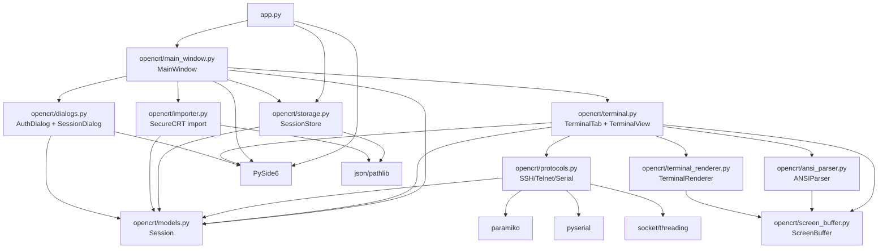
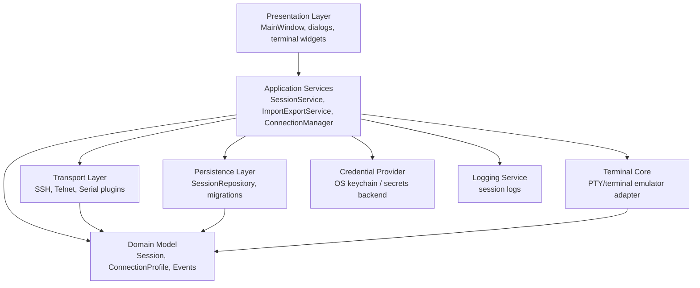

# OpenCRT Architecture

This document captures the current OpenCRT architecture as inspected from the repository source. It is intentionally descriptive and does not propose any runtime behavior change in the current implementation.

## Project overview

OpenCRT is a small PySide6 desktop terminal manager. The application stores connection profiles as JSON, displays them in a searchable tree, opens each connection in a tab, and supports SecureCRT session import. Runtime transport support is implemented for SSH, Telnet, and Serial connections.

## Current architecture

### Application entry point

- `app.py` is the application entry point.
- It creates the `QApplication`, applies the global Fusion style and stylesheet, prepares per-user data and log directories, constructs `SessionStore`, creates `MainWindow`, and starts the Qt event loop.
- User data is stored below `%APPDATA%/OpenCRT` on Windows or `Path.home()/OpenCRT` when `APPDATA` is not set.

### Session manager and persistence

- `opencrt/models.py` defines the `Session` dataclass used by the UI, storage, importers, and transports.
- `opencrt/storage.py` implements `SessionStore`, the current session manager/persistence layer. It loads `sessions.json`, optionally bootstraps from bundled data, and writes the complete session list back to disk on each mutation.
- `opencrt/session_service.py` implements `SessionService`, which owns create/update/delete/rename/duplicate/move/favorite operations and publishes typed session events.
- `opencrt/events.py` provides the `EventBus` and session event types used to notify UI and search layers when data changes.
- `MainWindow` consumes `SessionService`, listens for session events, and refreshes the visible tree when the underlying session data changes.

### Main window and user workflows

- `opencrt/main_window.py` defines `MainWindow`.
- It owns the search field, session tree, tab widget, toolbar, menu actions, and import actions.
- It filters sessions for search, maps tree items to `Session` objects, prompts for SSH credentials when needed, creates `TerminalTab` instances, and coordinates focus behavior after opening a connection.

### Terminal widget

- `opencrt/terminal.py` contains the terminal UI and connection orchestration.
- `opencrt/keyboard_mapper.py` contains `KeyboardMapper`, which translates Qt key events into profile-specific byte sequences before the widget forwards them to the transport.
- `opencrt/ansi_parser.py` parses incoming terminal output into structured operations and applies them to `ScreenBuffer`.
- `opencrt/screen_buffer.py` stores terminal state: rows, columns, cursor position, scrollback, wrapped lines, and per-cell styling.
- `opencrt/terminal_renderer.py` renders the current `ScreenBuffer` state into the `QPlainTextEdit`-based view.
- `TerminalView` subclasses `QPlainTextEdit`, delegates key translation to `KeyboardMapper`, pushes output into `ANSIParser`/`ScreenBuffer`, and asks `TerminalRenderer` to repaint the widget.
- `TerminalTab` wraps a `TerminalView` with status, reconnect, disconnect, and clear controls. It opens a log file per connection attempt, selects the transport implementation based on `Session.protocol`, forwards user input to the transport, and receives transport output via Qt signals.

### SSH implementation

- `opencrt/protocols.py` implements `SSHConnection` with Paramiko.
- It creates an `SSHClient`, applies `AutoAddPolicy`, connects using password or key/agent lookup depending on whether a password is present, invokes an interactive shell, polls the channel on a daemon thread, decodes bytes as UTF-8 with replacement, and forwards text to the terminal callback.

### Telnet implementation

- `opencrt/protocols.py` implements `TelnetConnection` using Python sockets.
- It creates a TCP connection, polls the socket on a daemon thread, strips a minimal subset of Telnet IAC negotiation commands, replies negatively to options, decodes bytes as UTF-8 with replacement, and forwards text to the terminal callback.

### Serial implementation

- `opencrt/protocols.py` implements `SerialConnection` using PySerial.
- It opens `session.serial_port` at `session.baudrate`, reads bytes on a daemon thread, decodes them as UTF-8 with replacement, and forwards text to the terminal callback.
- Although the `Session` model includes data bits, parity, and stop bits, the current serial implementation only applies port, baud rate, and timeout.

### Import/export

- `opencrt/importer.py` imports SecureCRT session definitions from ZIP archives or folders.
- It decodes INI content with several encodings, extracts `[S]` string and `[D]` DWORD settings, maps SecureCRT SSH, Telnet, and Serial records into `Session` objects, and derives groups from the imported path.
- `MainWindow.finish_import()` merges imported sessions by `(group, name, protocol)` and saves the session store.
- There is currently no explicit export feature beyond the JSON file maintained by `SessionStore`.

### Packaging and run scripts

- `RUN_OPENCRT.bat` creates or reuses `.venv`, installs requirements, and runs `app.py`.
- `BUILD_EXE.bat` creates or reuses `.venv`, installs requirements, and builds a one-file PyInstaller executable.
- `requirements.txt` declares PySide6, Paramiko, PySerial, and PyInstaller.

## Module dependency graph

## Current limitations

### Coupling and responsibility boundaries

- `MainWindow` mixes presentation, session management workflows, import orchestration, credential prompts, and connection/tab creation.
- `TerminalTab` mixes terminal UI, transport selection, log-file lifecycle, connection status handling, and reconnection behavior.
- `opencrt/protocols.py` contains all transport implementations in one module, making shared lifecycle behavior and protocol-specific behavior harder to test independently.
- Transport classes communicate with the UI through untyped callbacks rather than a clear event model.

### Threading and lifecycle

- Each connection starts a daemon thread directly inside the transport class.
- There is no central connection/session lifecycle manager that owns active connections, reconnect policies, cancellation, shutdown ordering, or terminal resize propagation.
- `close()` suppresses all exceptions and does not join worker threads, so shutdown ordering is best-effort.

### Terminal emulation

- `TerminalView` is a `QPlainTextEdit` rather than a terminal emulator.
- ANSI support is limited to removing basic CSI sequences, so color, cursor addressing, alternate screen, scrollback semantics, resize handling, and many interactive full-screen programs are not represented accurately.
- Input handling maps only a small set of keys and escape sequences.

### Protocol depth

- SSH host key handling uses Paramiko `AutoAddPolicy`; there is no known-hosts review or trust-on-first-use workflow.
- SSH authentication is limited to the current password/key-agent behavior exposed by Paramiko defaults.
- Telnet negotiation is intentionally minimal and rejects most options, so servers requiring richer Telnet negotiation may not work properly.
- Serial configuration ignores `databits`, `parity`, and `stopbits` even though the data model has those fields.

### Persistence and credentials

- `SessionStore` rewrites the whole JSON file for every save and has no migration/version metadata.
- Passwords can be stored as plain text when users select remember.
- There is no repository-level schema definition or validation layer for session data.

### Import/export

- SecureCRT import is implemented as parser functions plus UI merge logic, but there is no import service boundary.
- Export is not implemented as a user-facing feature.
- Import duplicate detection is based on `(group, name, protocol)` and does not consider host, port, serial port, or source.

### Testability

- The repository currently has no automated tests.
- UI, filesystem, network, threads, and transport selection are tightly coupled, making unit tests harder to add without refactoring.

## Biggest architectural problems

1. **No connection/session lifecycle manager.** Active terminal tabs create and own transport instances directly, so connection state, shutdown, reconnection, logging, and future features such as resize handling are spread across UI classes.
2. **UI and infrastructure are tightly coupled.** `MainWindow` and `TerminalTab` both perform orchestration work that would be easier to test and evolve in application-service classes.
3. **Terminal rendering is not a real terminal emulator.** The current text widget strips ANSI sequences instead of interpreting terminal state, which limits compatibility with common interactive CLI programs.
4. **Transports are monolithic and callback-oriented.** SSH, Telnet, and Serial share lifecycle concepts but have no explicit protocol interface, event type, or reusable worker abstraction.
5. **Session persistence lacks schema and secure credential handling.** Plain JSON storage is simple, but there is no migration versioning, validation, or secure password/keychain abstraction.

## Proposed architecture

### Target module boundaries

- `opencrt/domain/`
  - Owns pure data models and typed events.
  - Keeps transport-independent concepts separate from PySide6.
- `opencrt/services/session_service.py`
  - Owns create/update/delete/search workflows and delegates persistence to a repository.
- `opencrt/services/connection_manager.py`
  - Owns active connection lifecycle, worker threads, reconnect/disconnect semantics, and terminal resize propagation.
- `opencrt/transports/`
  - Splits SSH, Telnet, and Serial implementations into separate modules implementing a common `Connection` interface.
- `opencrt/persistence/`
  - Owns JSON repository, schema versioning, migrations, and future alternate backends.
- `opencrt/import_export/`
  - Owns SecureCRT import and future JSON/CSV/export workflows behind service APIs.
- `opencrt/ui/`
  - Owns PySide6 widgets and keeps orchestration logic thin.
- `opencrt/terminal/`
  - Owns terminal emulator integration or adapter boundaries separate from connection lifecycle.

## Roadmap

### Phase 1: Documentation and safety net

- Keep runtime behavior unchanged.
- Add architecture documentation and dependency graph.
- Add smoke/syntax checks to continuous integration.
- Add unit tests for `Session`, `SessionStore`, SecureCRT parsing, and Telnet IAC stripping.

### Phase 2: Extract services without behavior changes

- Introduce `SessionService` around `SessionStore` for search, upsert, delete, and import merge behavior.
- Introduce a common transport interface and move SSH, Telnet, and Serial implementations into separate modules.
- Introduce typed connection events instead of raw output/closed callbacks.
- Move log-file creation and lifecycle into a logging service.

### Phase 3: Connection lifecycle manager

- Add `ConnectionManager` to own active connections and worker lifecycle.
- Replace daemon-thread fire-and-forget behavior with managed workers and explicit shutdown.
- Add terminal resize propagation from the widget/tab to transports that support it.
- Centralize reconnect and disconnect behavior.

### Phase 4: Terminal capability improvements

- Evaluate integrating a real terminal emulator component or state-machine parser.
- Preserve color, cursor movement, alternate screen behavior, and scrollback semantics.
- Expand keyboard/input mapping and clipboard/paste handling.

### Phase 5: Persistence, credentials, and import/export

- Add session schema versioning and migrations.
- Add validation for protocol-specific fields.
- Replace plain-text remembered passwords with an OS keychain-backed credential provider.
- Add explicit export workflows and document import/export compatibility guarantees.

### Phase 6: Protocol maturity

- Add SSH known-hosts policy and user-facing host key verification.
- Improve SSH authentication options and error reporting.
- Expand Telnet negotiation support where needed.
- Apply serial data bits, parity, and stop bits from the model.
